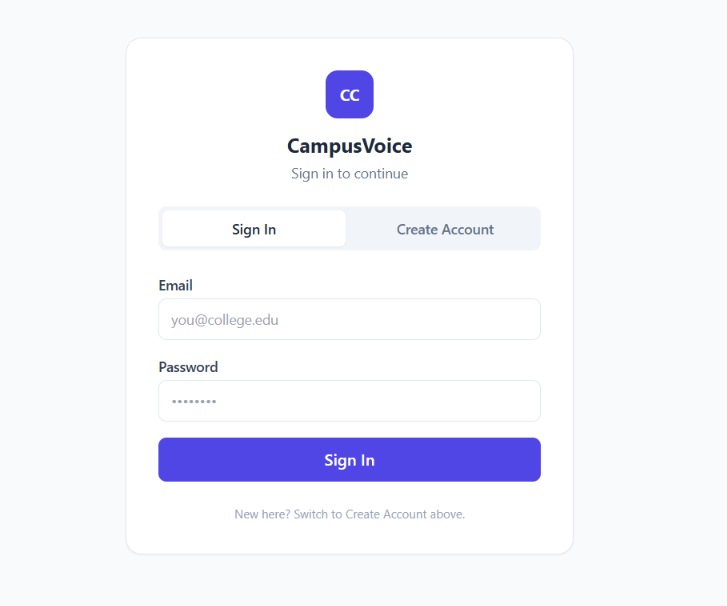
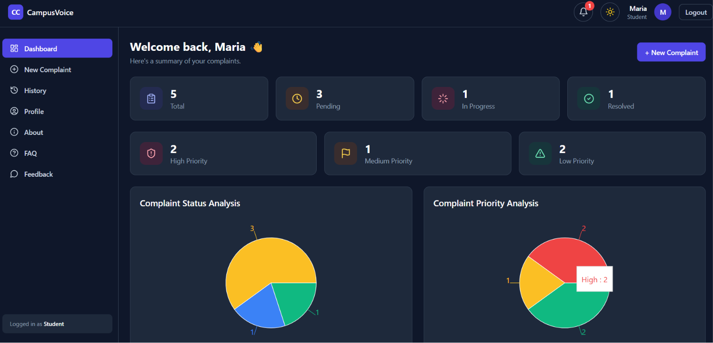
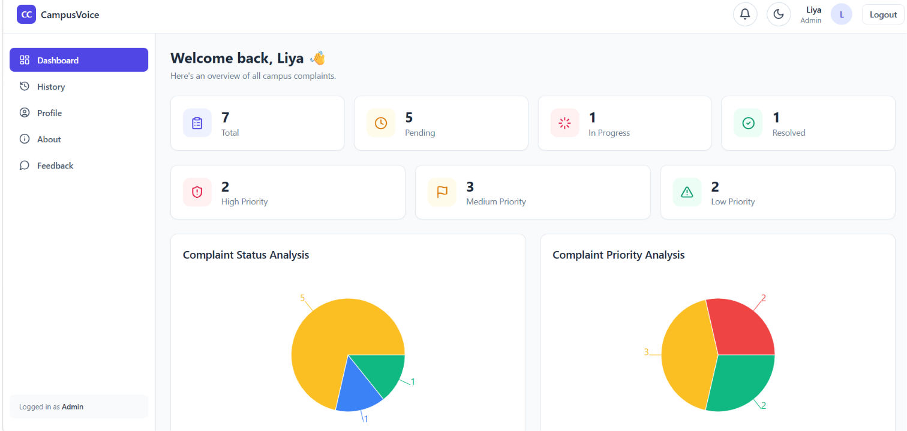
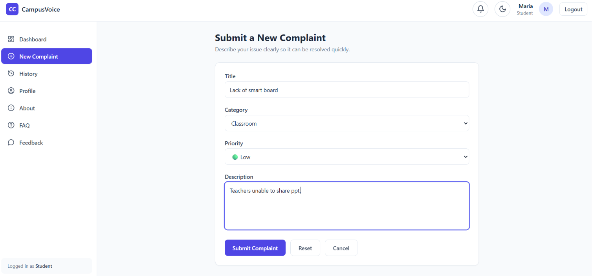
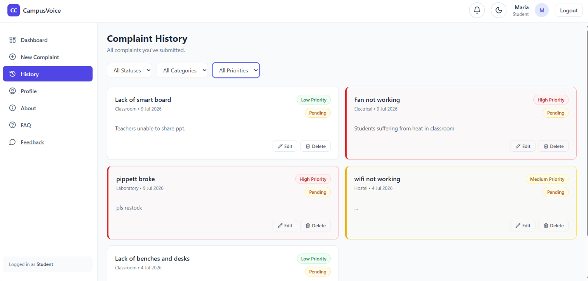
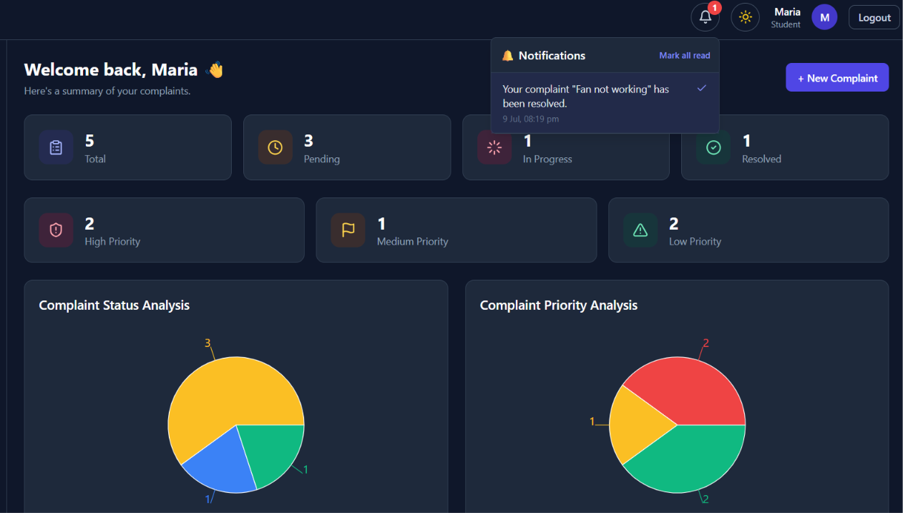
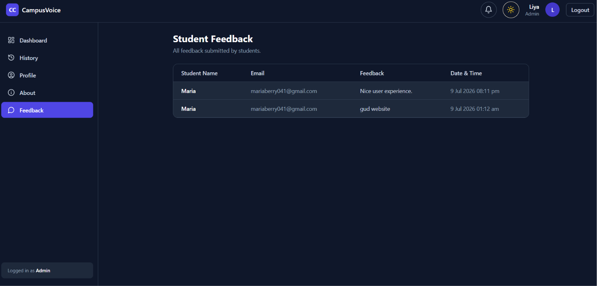
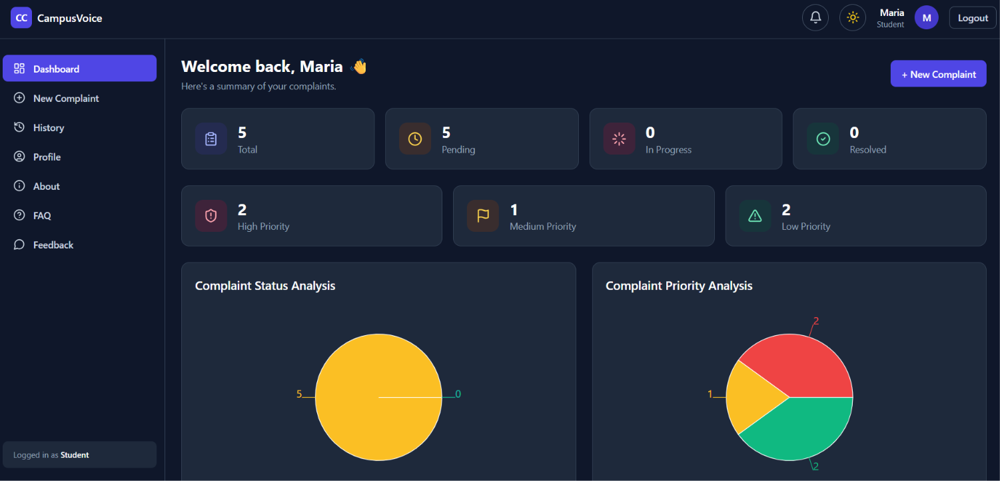

<p align="center">
  
  
  
  
  
  
  
</p>

<h1 align="center">🏫 CampusVoice</h1>

<p align="center">
  <strong>A full-stack Campus Complaint Management System built with the MERN stack.</strong><br/>
  Empowering students to report campus issues and enabling administrators to track, manage, and resolve them efficiently.
</p>

---

## 📋 Table of Contents

- [Project Overview](#-project-overview)
- [Features](#-features)
- [Tech Stack](#-tech-stack)
- [Project Architecture](#-project-architecture)
- [Folder Structure](#-folder-structure)
- [Installation & Setup](#-installation--setup)
- [Environment Variables](#-environment-variables)
- [API Endpoints](#-api-endpoints)
- [Usage Instructions](#-usage-instructions)
- [Screenshots](#-screenshots)
- [Contributors](#-contributors)
- [License](#-license)

---

## 🔍 Project Overview

**CampusVoice** is a web-based complaint management platform designed for educational institutions. It provides separate dashboards for **Students** and **Administrators**, enabling a streamlined workflow for submitting, tracking, and resolving campus-related complaints.

Students can submit complaints with categories and priority levels, track their status in real time, and receive both email and in-app notifications when their complaints are resolved. Administrators get a comprehensive overview with analytics, charts, and the ability to manage complaints and view student feedback — all within a clean, responsive UI with dark mode support.

---

## ✨ Features

### 🎓 Student Dashboard
| Feature | Description |
|---------|-------------|
| **Submit Complaints** | File new complaints with title, category, priority (Low/Medium/High), and description |
| **Track Status** | View real-time status of all submitted complaints (Pending → In Progress → Resolved) |
| **Complaint History** | Browse, filter (by status, category, priority), edit, and delete past complaints |
| **Priority Analytics** | Visual breakdown of complaints by priority via interactive pie charts |
| **Status Analytics** | Visual breakdown of complaints by status via pie charts |
| **Monthly Statistics** | Bar chart showing complaint volume per month |
| **Email Notifications** | Receive email alerts when a complaint is resolved |
| **In-App Notifications** | Bell icon with unread count badge; real-time notifications in the navbar |
| **Submit Feedback** | Share suggestions to help improve the platform |
| **FAQ** | Frequently asked questions about using the platform |
| **Dark Mode** | Toggle between light and dark themes across the entire application |

### 🛡️ Admin Dashboard
| Feature | Description |
|---------|-------------|
| **All Complaints Overview** | View every complaint submitted across campus with student details |
| **Update Complaint Status** | Change status of any complaint (Pending / In Progress / Resolved) |
| **Priority & Status Analytics** | Dashboard cards + pie charts for High/Medium/Low priority and status breakdown |
| **Monthly Statistics** | Campus-wide complaint trends over the year |
| **In-App Notifications** | Automatically notified when any student submits a new complaint |
| **Student Feedback Management** | View all student feedback in a table (student name, email, message, date & time) |
| **Dark Mode** | Full dark mode support across all admin pages |

### 🔐 Security
| Feature | Description |
|---------|-------------|
| **Password Hashing** | All passwords hashed with bcrypt (salt rounds: 10) via Mongoose pre-save hook |
| **JWT Authentication** | Stateless token-based auth with configurable expiry |
| **Role-Based Access Control** | `protect` middleware for auth; `authorize("admin")` middleware for admin-only routes |
| **Password Never Exposed** | Password field has `select: false` in the User schema |

---

## 🛠️ Tech Stack

### Frontend
| Technology | Purpose |
|-----------|---------|
| **React 18** | UI library with functional components and hooks |
| **Vite 7** | Fast development server and production bundler |
| **React Router DOM 6** | Client-side routing with protected routes |
| **TailwindCSS 3** | Utility-first CSS framework with `darkMode: "class"` |
| **Recharts** | Interactive charts (PieChart, BarChart) for analytics |
| **Lucide React** | Modern icon library |
| **Axios** | HTTP client (used in legacy feedback; centralized `fetch` API in `api.js`) |

### Backend
| Technology | Purpose |
|-----------|---------|
| **Node.js** | JavaScript runtime |
| **Express 4** | Web framework for REST API |
| **Mongoose 8** | MongoDB ODM with schema validation |
| **bcryptjs** | Password hashing |
| **jsonwebtoken** | JWT token generation and verification |
| **Nodemailer** | Email notifications via Gmail SMTP |
| **express-async-handler** | Async error handling wrapper for controllers |
| **dotenv** | Environment variable management |

### Database
| Technology | Purpose |
|-----------|---------|
| **MongoDB** | NoSQL document database (local or Atlas) |

### Dev Tools
| Technology | Purpose |
|-----------|---------|
| **Nodemon** | Auto-restart backend on file changes |
| **PostCSS + Autoprefixer** | CSS processing pipeline for Tailwind |

---

## 🏗️ Project Architecture

```
┌─────────────────────────────────────────────────────────────────┐
│                         CLIENT (React)                          │
│  ┌──────────┐  ┌──────────┐  ┌──────────┐  ┌───────────────┐  │
│  │  Pages   │  │Components│  │ Contexts  │  │  Utils/API    │  │
│  │Dashboard │  │ComplaintC│  │AuthContext│  │ api.js        │  │
│  │History   │  │Navbar    │  │ThemeCtx   │  │ complaintsStr │  │
│  │AddComplnt│  │Sidebar   │  │NotifyCtx  │  │               │  │
│  │Feedback  │  │Charts    │  │           │  │               │  │
│  │Login/etc │  │StatCard  │  │           │  │               │  │
│  └──────┬───┘  └──────────┘  └───────────┘  └───────┬───────┘  │
│         │              HTTP (fetch)                   │          │
│         └───────────────────┬─────────────────────────┘          │
└─────────────────────────────┼───────────────────────────────────┘
                              │  REST API (JSON)
┌─────────────────────────────┼───────────────────────────────────┐
│                         SERVER (Express)                        │
│  ┌──────────┐  ┌──────────┐  ┌──────────┐  ┌───────────────┐  │
│  │  Routes  │  │Controllers│ │Middleware │  │   Utils       │  │
│  │/auth     │  │auth      │  │protect   │  │ mailer.js     │  │
│  │/complaints│ │complaint │  │authorize │  │ (Nodemailer)  │  │
│  │/feedback │  │feedback  │  │errorHandl│  │               │  │
│  │/notifica │  │notificatn│  │           │  │               │  │
│  └──────┬───┘  └──────────┘  └───────────┘  └───────────────┘  │
│         │                                                       │
│  ┌──────┴───────────────────────────────────────────────────┐   │
│  │                    Models (Mongoose)                      │   │
│  │  User  │  Complaint  │  Feedback  │  Notification        │   │
│  └──────────────────────────────────────────────────────────┘   │
└─────────────────────────────┼───────────────────────────────────┘
                              │
                    ┌─────────┴─────────┐
                    │   MongoDB          │
                    │   (campusvoice)    │
                    └───────────────────┘
```

### Data Storage Map

| Data | Collection | Model | Controller | Key API Routes |
|------|-----------|-------|------------|----------------|
| Users | `users` | `User.js` | `authController.js` | `POST /register`, `POST /login`, `GET /me` |
| Complaints | `complaints` | `Complaint.js` | `complaintController.js` | Full CRUD + status update |
| Feedback | `feedbacks` | `Feedback.js` | `feedbackController.js` | `POST /` (student), `GET /` (admin) |
| Notifications | `notifications` | `Notification.js` | `notificationController.js` | `GET /`, `PATCH /read-all`, `PATCH /:id/read` |

---

## 📁 Folder Structure

```
CampusVoice/
├── .gitignore
├── README.md
│
├── backend/
│   ├── .env.example                  # Example environment variables
│   ├── .gitignore
│   ├── package.json
│   ├── package-lock.json
│   ├── server.js                     # Express app entry point
│   │
│   ├── config/
│   │   └── db.js                     # MongoDB connection (Mongoose)
│   │
│   ├── controllers/
│   │   ├── authController.js         # Register, login, getMe
│   │   ├── complaintController.js    # CRUD + status update + notifications
│   │   ├── feedbackController.js     # Add feedback, get all feedback
│   │   └── notificationController.js # Get, mark read, mark all read
│   │
│   ├── middleware/
│   │   ├── authMiddleware.js         # JWT protect + role authorize
│   │   └── errorMiddleware.js        # Global error handler + 404
│   │
│   ├── models/
│   │   ├── Complaint.js              # title, description, category, priority, status, student
│   │   ├── Feedback.js               # user (ref), message
│   │   ├── Notification.js           # user (ref), message, type, complaintId, read
│   │   └── User.js                   # name, email, password (hashed), role
│   │
│   ├── routes/
│   │   ├── authRoutes.js             # /api/auth/*
│   │   ├── complaintRoutes.js        # /api/complaints/*
│   │   ├── feedbackRoutes.js         # /api/feedback/*
│   │   └── notificationRoutes.js     # /api/notifications/*
│   │
│   └── utils/
│       └── mailer.js                 # Nodemailer Gmail transporter
│
└── frontend/
    ├── index.html
    ├── package.json
    ├── package-lock.json
    ├── vite.config.js                # Vite configuration
    ├── tailwind.config.js            # TailwindCSS with darkMode: "class"
    ├── postcss.config.js             # PostCSS plugins
    ├── .env.example                  # Frontend env template
    │
    └── src/
        ├── main.jsx                  # React DOM entry point
        ├── App.jsx                   # Router + providers + route definitions
        ├── index.css                 # Tailwind directives + base styles
        │
        ├── components/
        │   ├── ComplaintCard.jsx      # Complaint display/edit/delete card
        │   ├── MonthlyStatistics.jsx  # Bar chart (Recharts)
        │   ├── Navbar.jsx            # Top bar: logo, notifications, theme toggle, logout
        │   ├── Notification.jsx      # Toast notification overlay
        │   ├── PriorityPieChart.jsx  # Priority analysis pie chart
        │   ├── Sidebar.jsx           # Navigation sidebar (role-aware)
        │   ├── StatCard.jsx          # Metric card with icon
        │   └── StatusPieChart.jsx    # Status analysis pie chart
        │
        ├── context/
        │   ├── AuthContext.jsx       # Authentication state + login/register/logout
        │   ├── NotificationContext.jsx # Toast notification state (ephemeral)
        │   └── ThemeContext.jsx       # Dark mode toggle + localStorage persistence
        │
        ├── layouts/
        │   └── MainLayout.jsx        # Navbar + Sidebar + Outlet wrapper
        │
        ├── pages/
        │   ├── About.jsx             # About CampusVoice
        │   ├── AddComplaint.jsx      # New complaint form (student only)
        │   ├── Dashboard.jsx         # Stats, charts, recent complaints
        │   ├── FAQ.jsx               # Frequently asked questions (student only)
        │   ├── Feedback.jsx          # Submit (student) / View table (admin)
        │   ├── History.jsx           # All complaints with filters
        │   ├── Login.jsx             # Sign in / Create account
        │   └── Profile.jsx           # User profile info
        │
        └── utils/
            ├── api.js                # Centralized API client (fetch + JWT)
            └── complaintsStore.js    # Shared constants (CATEGORIES, STATUSES, PRIORITIES)
```

---

## 🚀 Installation & Setup

### Prerequisites

- **Node.js** v18+ and **npm** v9+
- **MongoDB** (local instance or [MongoDB Atlas](https://www.mongodb.com/atlas))
- **Git**

### 1. Clone the Repository

```bash
git clone https://github.com/Berry-Maria-Prince/CampusVoice
cd campusvoice
```

### 2. Backend Setup

```bash
cd backend
npm install
```

Create a `.env` file in the `backend/` directory (see [Environment Variables](#-environment-variables)).

```bash
# Start development server (with auto-restart)
npm run dev

# Or start production server
npm start
```

The backend will start on `http://localhost:5000`.

### 3. Frontend Setup

```bash
cd frontend
npm install
```

Optionally create a `.env` file if your backend runs on a different URL:

```
VITE_API_URL=http://localhost:5000/api
```

```bash
# Start development server
npm run dev
```

The frontend will start on `http://localhost:5173`.

### 4. Open in Browser

Navigate to `http://localhost:5173` — you'll see the login/register page.

---

## 🔐 Environment Variables

### Backend (`backend/.env`)

| Variable | Description | Example |
|----------|-------------|---------|
| `MONGO_URI` | MongoDB connection string | `mongodb://127.0.0.1:27017/campusvoice` |
| `JWT_SECRET` | Secret key for signing JWTs | `your_long_random_secret_key_here` |
| `JWT_EXPIRES_IN` | Token expiration duration | `7d` |
| `PORT` | Backend server port | `5000` |
| `CLIENT_URL` | Frontend URL (for CORS) | `http://localhost:5173` |
| `EMAIL_USER` | Gmail address for sending notifications | `your-email@gmail.com` |
| `EMAIL_PASS` | Gmail App Password (not your login password) | `xxxx xxxx xxxx xxxx` |

> [!IMPORTANT]
> For `EMAIL_PASS`, you need a **Gmail App Password**, not your regular Gmail password. Enable 2-Step Verification in your Google account, then generate an App Password at [myaccount.google.com/apppasswords](https://myaccount.google.com/apppasswords).

### Frontend (`frontend/.env`) — Optional

| Variable | Description | Default |
|----------|-------------|---------|
| `VITE_API_URL` | Backend API base URL | `http://localhost:5000/api` |

---

## 📡 API Endpoints

### Authentication — `/api/auth`

| Method | Endpoint | Access | Description |
|--------|----------|--------|-------------|
| `POST` | `/register` | Public | Register a new user (student/admin) |
| `POST` | `/login` | Public | Authenticate and receive JWT token |
| `GET` | `/me` | Private | Get the logged-in user's profile |

### Complaints — `/api/complaints`

| Method | Endpoint | Access | Description |
|--------|----------|--------|-------------|
| `GET` | `/` | Private | Get complaints (students: own; admins: all) |
| `POST` | `/` | Student | Create a new complaint |
| `GET` | `/:id` | Private | Get a single complaint by ID |
| `PUT` | `/:id` | Owner | Update complaint fields (title, description, category, priority) |
| `PATCH` | `/:id/status` | Admin | Update complaint status (Pending / In Progress / Resolved) |
| `DELETE` | `/:id` | Owner/Admin | Delete a complaint |

### Feedback — `/api/feedback`

| Method | Endpoint | Access | Description |
|--------|----------|--------|-------------|
| `POST` | `/` | Private | Submit feedback (any logged-in user) |
| `GET` | `/` | Admin | Get all feedback with user details (name, email) |

### Notifications — `/api/notifications`

| Method | Endpoint | Access | Description |
|--------|----------|--------|-------------|
| `GET` | `/` | Private | Get all notifications for the logged-in user |
| `PATCH` | `/read-all` | Private | Mark all notifications as read |
| `PATCH` | `/:id/read` | Private | Mark a single notification as read |

### Health Check

| Method | Endpoint | Access | Description |
|--------|----------|--------|-------------|
| `GET` | `/api/health` | Public | Returns `{ status: "ok" }` if the API is running |

---

## 📖 Usage Instructions

### For Students

1. **Register** — Go to the login page, switch to "Create Account", select **Student**, and fill in your details.
2. **Submit a Complaint** — Click **"+ New Complaint"** on the dashboard or navigate to "New Complaint" in the sidebar. Fill in the title, select a category and priority, then describe the issue.
3. **Track Complaints** — View status updates on the **Dashboard** or go to **History** for a full filterable list.
4. **Check Notifications** — Click the 🔔 bell icon in the navbar. You'll see notifications when your complaints are resolved.
5. **Submit Feedback** — Navigate to **Feedback** in the sidebar to share suggestions.

### For Administrators

1. **Register** — Create an account with the **Admin** role.
2. **Dashboard** — View campus-wide complaint statistics: total, pending, in progress, resolved counts plus priority breakdown.
3. **Manage Complaints** — Update the status of any complaint using the dropdown on each complaint card. When you set a complaint to "Resolved", the student receives both an **email** and an **in-app notification**.
4. **Check Notifications** — Click the 🔔 bell icon to see new complaint submissions from students.
5. **View Feedback** — Navigate to **Feedback** to see a table of all student-submitted feedback.
6. **History** — Filter complaints by status, category, and priority.

### Dark Mode

Click the 🌙/☀️ toggle button in the top-right navbar. The preference is saved to `localStorage` and persists across sessions.

---

## 📸 Screenshots

### Login Page
<!--  -->


### Student Dashboard
<!--  -->


### Admin Dashboard
<!--  -->


### New Complaint Form
<!--  -->


### Complaint History (with Filters)
<!--  -->


### In-App Notifications
<!--  -->


### Admin Feedback Management
<!--  -->


### Dark Mode
<!--  -->


---

## 👥 Contributors

1.Berry Maria Prince
2.Adithyan S S
3.Harsha H B
4.Anandhu Krishna S
5.Nayana A N


---

## 📄 License

This project is licensed under the **MIT License**.

```
MIT License

Copyright (c) 2026

Permission is hereby granted, free of charge, to any person obtaining a copy
of this software and associated documentation files (the "Software"), to deal
in the Software without restriction, including without limitation the rights
to use, copy, modify, merge, publish, distribute, sublicense, and/or sell
copies of the Software, and to permit persons to whom the Software is
furnished to do so, subject to the following conditions:

The above copyright notice and this permission notice shall be included in all
copies or substantial portions of the Software.

THE SOFTWARE IS PROVIDED "AS IS", WITHOUT WARRANTY OF ANY KIND, EXPRESS OR
IMPLIED, INCLUDING BUT NOT LIMITED TO THE WARRANTIES OF MERCHANTABILITY,
FITNESS FOR A PARTICULAR PURPOSE AND NONINFRINGEMENT.
```

---

<p align="center">
  Made with ❤️ for campus communities
</p>
